# 30 Day Map Challenge 2025

Repo for the **30 Day Map Challenge 2025**  
https://30daymapchallenge.com/  

This repo holds my daily solutions to each of the challenges :) 

---

## Day 01 — Points 📌

---

## Day 02 — Lines 📏

A map of railways in Japan, using [OSM data](https://data.humdata.org/dataset/hotosm_jpn_railways).

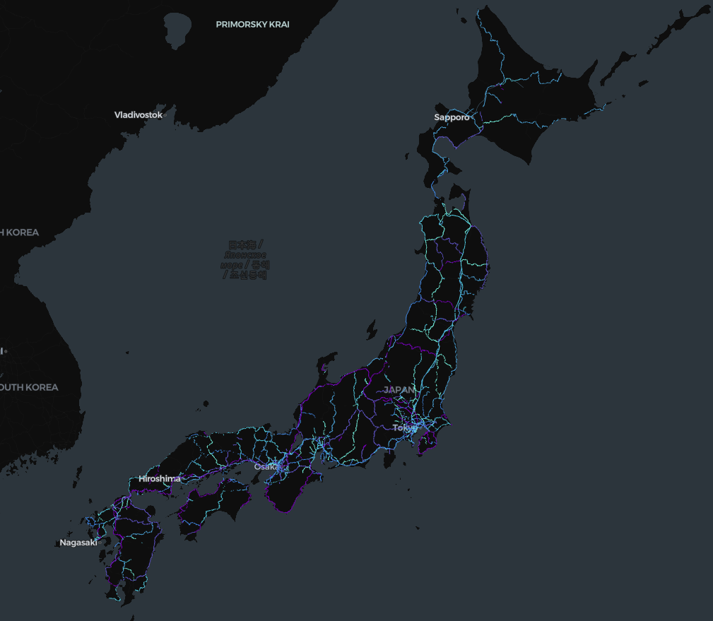

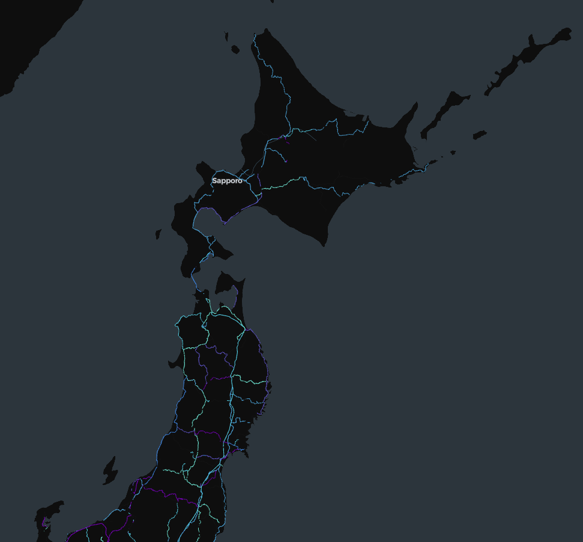

---

## Day 03 — Polygons 🛑

Map of Manhattan's building heights! Made using [NYC Open Data](https://data.cityofnewyork.us/City-Government/BUILDING/5zhs-2jue/about_data) on Kepler.gl.

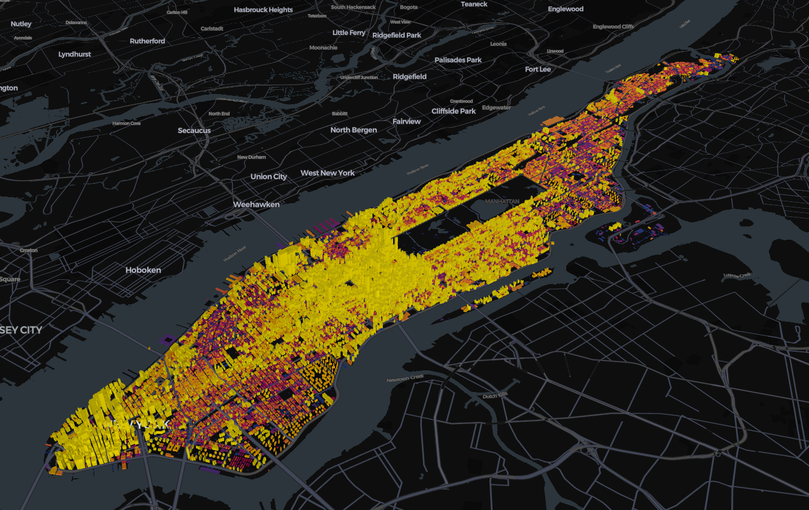
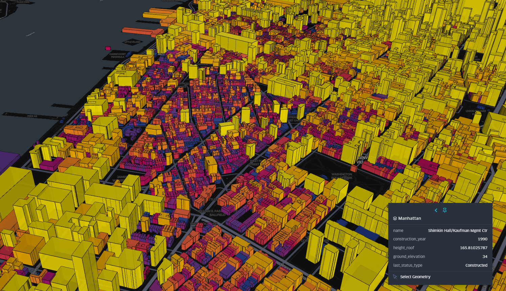
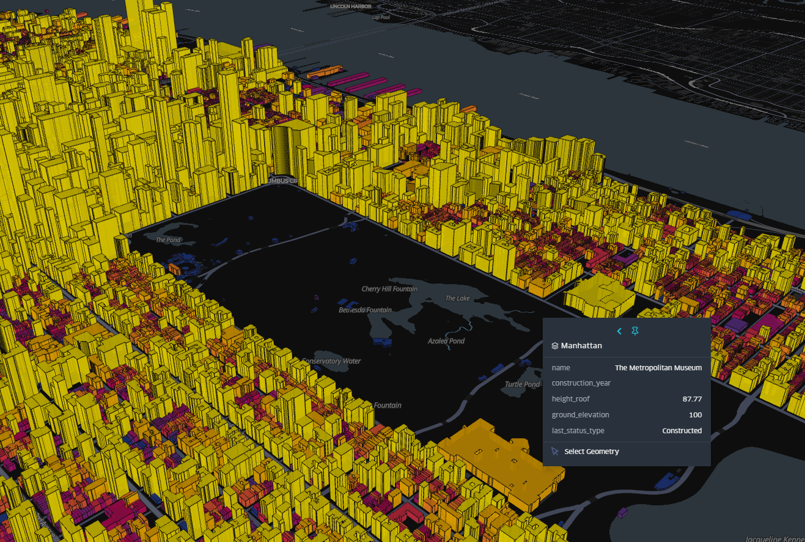

---

## Day 04 — My Data 🏃‍♀️

I used my Strava data from a multiday hike I did in New Zealand - the Kepler Track. I used QGIS to
- combine the different days GPX
- to create the elevation map using 8m DEM data from LINZ
- used the QuickOSM plugin for the water bodies (the lakes)

I touched it up on Photoshop and added icons and labels

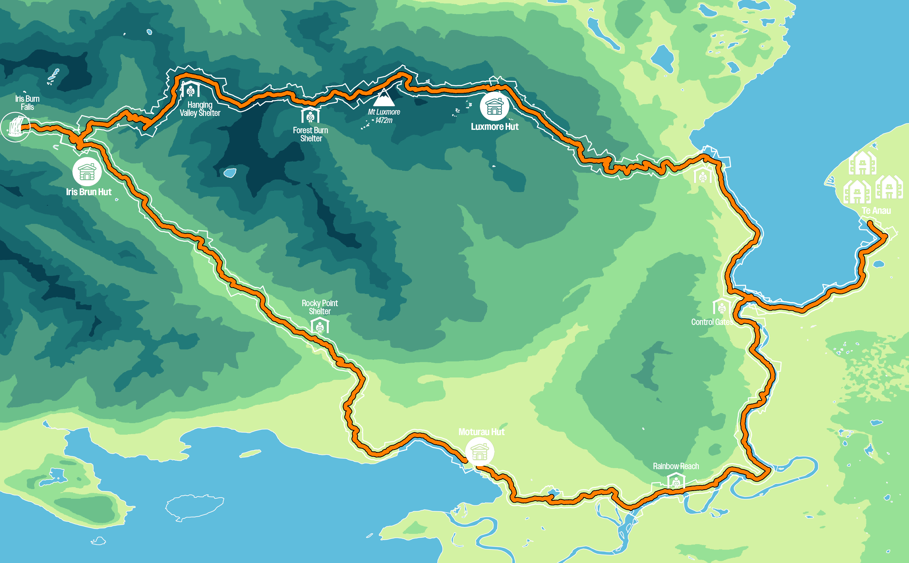

---

## Day 05 — Earth 🌍

For the Earth theme, I built an interactive 3D globe visualizing the [RESOLVE Ecoregions Dataset (2017) dataset](https://developers.google.com/earth-engine/datasets/catalog/RESOLVE_ECOREGIONS_2017).  
I converted the source shapefiles into vector tiles (Mapbox Tilesets) and rendered them using Mapbox GL JS’s globe projection. Each region is styled by biome, with hover interactions to explore ecosystems across the planet. 

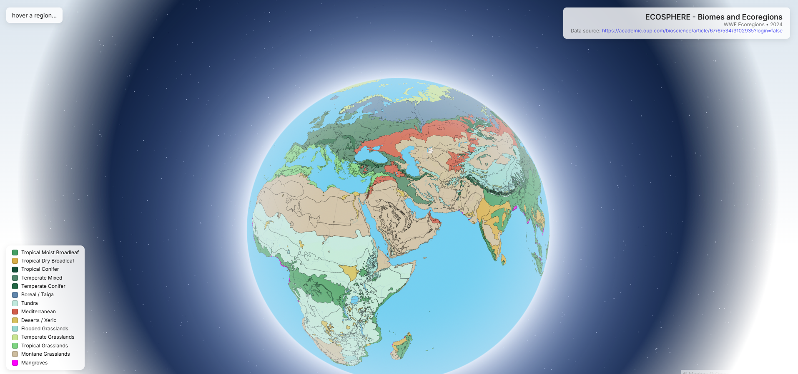

---

## Day 06 — Dimensions 🧊

A map of ocean depth using data from [GEBCO](https://www.gebco.net/data-products/gridded-bathymetry-data) overlayed with migration patterns of 20 humpback whales from [OBIS](https://obis.org/data/access/).

I picked a sample of male and female whales with most sightings and plotted their weekly moves in the last 20 years.

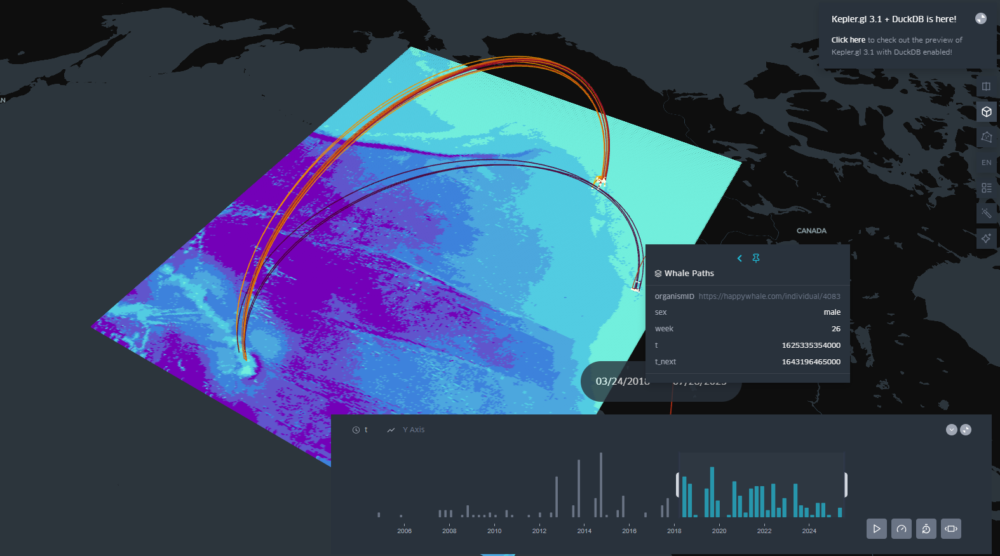

---

## Day 07 — Acessibility 🏙️

A map of Sofia sidewalk quality using OSM data.

Sofia sidewalks are notoriously bad, especially in autumn/winter when it is raining and you don't know if you'll step on a tile and your foot will sink into a puddle...

Apparently [this OSM tag](https://wiki.openstreetmap.org/wiki/Key:smoothness) is user recorded so may not be 100% accurate but it is somewhat reflective of reality. 

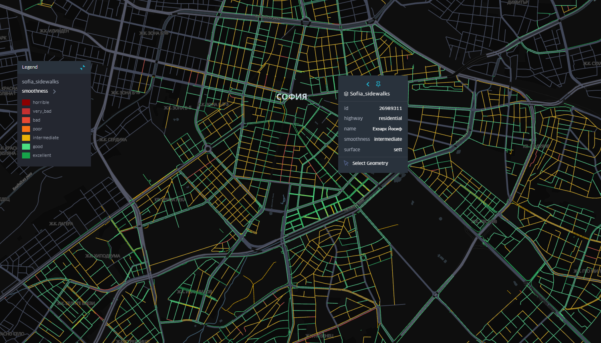

---

## Day 08 — Urban 🐕

A map of London with a score of how dog friendly each borough is. The scores are based on OSM data on dog parks, vet clinics, pet stores in each borough (locations mapped as points).

### Scoring method

1. Counted vet clinics, pet shops, animal shelters & dog parks for each borough
2. Calculated area to normalize and allow fair comparison -> converted raw counts above to densities (count / area_km² * 10 → number per 10 km²)
3. Applied Min-Max nomalization to each category -> get 0-1 scale
4. Chose weighted scores
- vets: 40%
- pet shops: 30%
- shelters: 20%
- dog parks: 10%
5. Final score per borough = weighted sum of all normalized densities
6. Broke scores into 4 quantile classes (Low, Med, High, Supreme)

---

## Day 09 — Analog 🎨

With Wicked 2 coming out in just a few weeks, I just had to draw a map of Oz for today's challenge 💚🩷

---

## Day 10 — Air 🍃

Created an animated map of wind speed and temperature of [Hurricane Melissa](https://en.wikipedia.org/wiki/Hurricane_Melissa) from October 28th, using ERA5 hourly data and QGIS.

---

## Day 11 — Minimalist 🫧

Created a map of Lloseta, Mallorca using OSM data. Did base map on QGIS and labels on Photoshop.

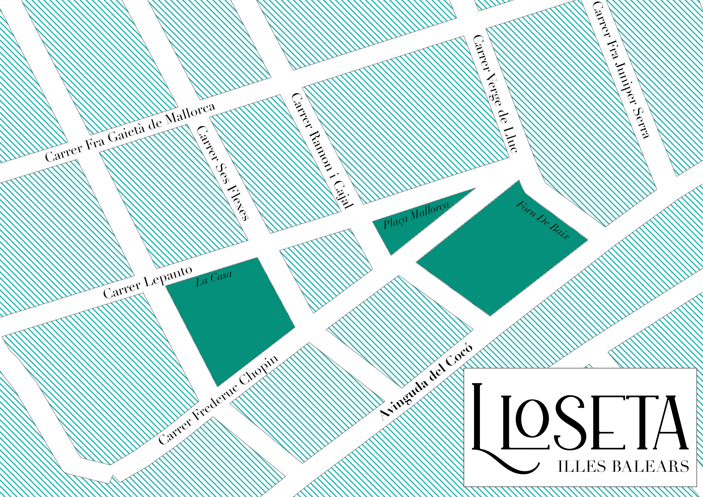

---

## Day 12 — Map from 2125 ⌛

Map of change in population as projected by the UN ([UN Population Data](https://population.un.org/dataportal/)). Made using Kepler.gl.
Technically for the year 2100...

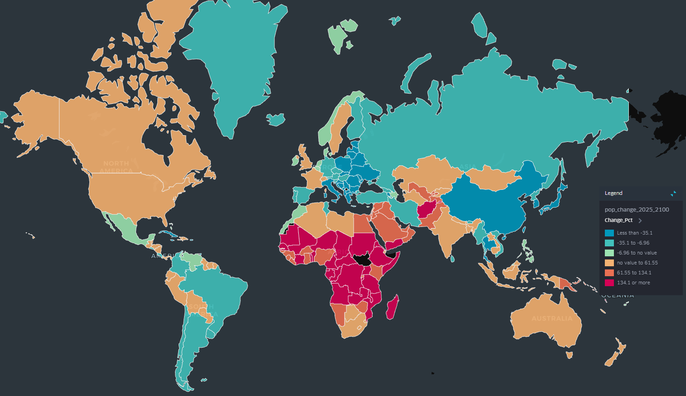

---

## Day 13 — 10 Minute Map ⏩

Quick map of a hike I did in Menorca. Plotted on QGIS, using ESRI Satellite data as the background + some OSM labels

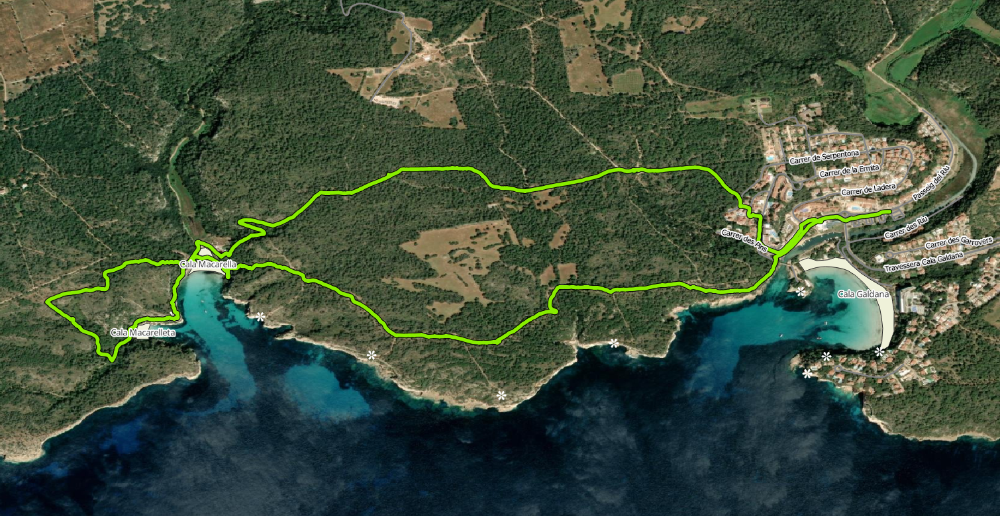

---

## Stack

- QGIS
  - QuickOSM plugin
- Mapbox GL JS
- Mapbox Tilesets  
- Python (Pandas, GeoPandas, Numpy, Sklearn)
- HTML + CSS  
- Kepler.gl
- Photoshop (for touch ups)

---

## Data

- OSM
- [Japan Railways (OSM)](https://data.humdata.org/dataset/hotosm_jpn_railways)
- [NYC Open Data](https://data.cityofnewyork.us/City-Government/BUILDING/5zhs-2jue/about_data)
- [RESOLVE Ecoregions Dataset (2017) dataset](https://developers.google.com/earth-engine/datasets/catalog/RESOLVE_ECOREGIONS_2017)
- [LINZ 8m DEM data (2012)](https://data.linz.govt.nz/layer/51768-nz-8m-digital-elevation-model-2012/)
- [GEBCO Ocean Bathymetry Data](https://www.gebco.net/data-products/gridded-bathymetry-data)
- [OBIS Whale Sighting Data](https://obis.org/data/access/)
- [Dog population per postcode district](https://www.data.gov.uk/dataset/)
- [London Boroughs GPKG](https://data.london.gov.uk/dataset/london-boroughs-e55pw/)
- [ERA 5 Hourly Data](https://cds.climate.copernicus.eu/datasets/reanalysis-era5-single-levels?tab=download)
- [UN Population Data](https://population.un.org/dataportal/)
- ESRI Satellite Data
- Strava
