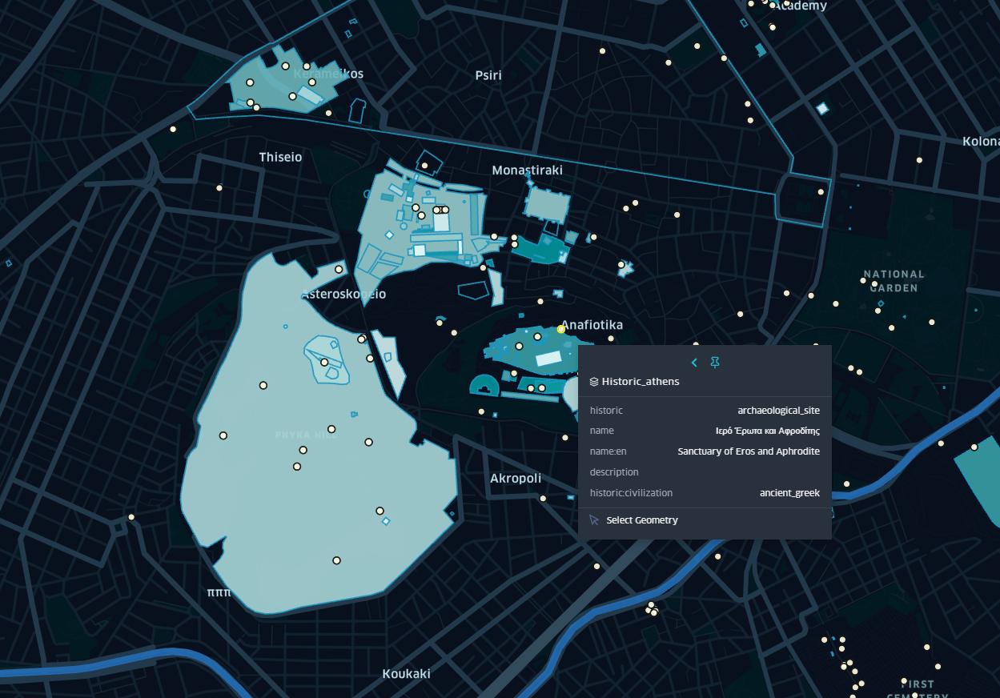
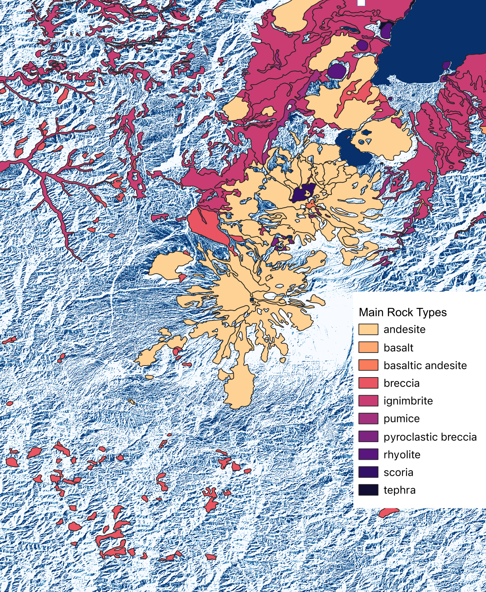
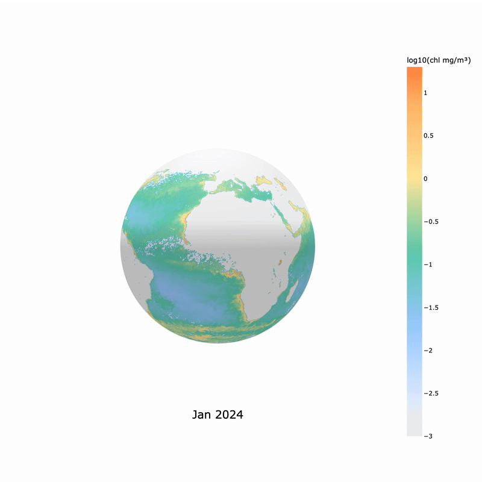

# 30 Day Map Challenge 2025

Repo for the **30 Day Map Challenge 2025**  
https://30daymapchallenge.com/  

This repo holds my daily solutions to each of the challenges :) 

---

## Day 01 — Points 📌

---

## Day 02 — Lines 📏

A map of railways in Japan, using [OSM data](https://data.humdata.org/dataset/hotosm_jpn_railways).

---

## Day 03 — Polygons 🛑

Map of Manhattan's building heights! Made using [NYC Open Data](https://data.cityofnewyork.us/City-Government/BUILDING/5zhs-2jue/about_data) on Kepler.gl.

---

## Day 04 — My Data 🏃‍♀️

I used my Strava data from a multiday hike I did in New Zealand - the Kepler Track. I used QGIS to
- combine the different days GPX
- to create the elevation map using 8m DEM data from LINZ
- used the QuickOSM plugin for the water bodies (the lakes)

I touched it up on Photoshop and added icons and labels

---

## Day 05 — Earth 🌍

For the Earth theme, I built an interactive 3D globe visualizing the [RESOLVE Ecoregions Dataset (2017) dataset](https://developers.google.com/earth-engine/datasets/catalog/RESOLVE_ECOREGIONS_2017).  
I converted the source shapefiles into vector tiles (Mapbox Tilesets) and rendered them using Mapbox GL JS’s globe projection. Each region is styled by biome, with hover interactions to explore ecosystems across the planet. 

---

## Day 06 — Dimensions 🧊

A map of ocean depth using data from [GEBCO](https://www.gebco.net/data-products/gridded-bathymetry-data) overlayed with migration patterns of 20 humpback whales from [OBIS](https://obis.org/data/access/).

I picked a sample of male and female whales with most sightings and plotted their weekly moves in the last 20 years.

---

## Day 07 — Acessibility 🏙️

A map of Sofia sidewalk quality using OSM data.

Sofia sidewalks are notoriously bad, especially in autumn/winter when it is raining and you don't know if you'll step on a tile and your foot will sink into a puddle...

Apparently [this OSM tag](https://wiki.openstreetmap.org/wiki/Key:smoothness) is user recorded so may not be 100% accurate but it is somewhat reflective of reality. 

---

## Day 08 — Urban 🐕

A map of London with a score of how dog friendly each borough is. The scores are based on OSM data on dog parks, vet clinics, pet stores in each borough (locations mapped as points).

### Scoring method

1. Counted vet clinics, pet shops, animal shelters & dog parks for each borough
2. Calculated area to normalize and allow fair comparison -> converted raw counts above to densities (count / area_km² * 10 → number per 10 km²)
3. Applied Min-Max nomalization to each category -> get 0-1 scale
4. Chose weighted scores
- vets: 40%
- pet shops: 30%
- shelters: 20%
- dog parks: 10%
5. Final score per borough = weighted sum of all normalized densities
6. Broke scores into 4 quantile classes (Low, Med, High, Supreme)

---

## Day 09 — Analog 🎨

With Wicked 2 coming out in just a few weeks, I just had to draw a map of Oz for today's challenge 💚🩷

---

## Day 10 — Air 🍃

Created an animated map of wind speed and temperature of [Hurricane Melissa](https://en.wikipedia.org/wiki/Hurricane_Melissa) from October 28th, using ERA5 hourly data and QGIS.

---

## Day 11 — Minimalist 🫧

Created a map of Lloseta, Mallorca using OSM data. Did base map on QGIS and labels on Photoshop.

---

## Day 12 — Map from 2125 ⌛

Map of change in population as projected by the UN ([UN Population Data](https://population.un.org/dataportal/)). Made using Kepler.gl.
Technically for the year 2100...

---

## Day 13 — 10 Minute Map ⏩

Quick map of a hike I did in Menorca. Plotted on QGIS, using ESRI Satellite data as the background + some OSM labels

---

## Day 14 — OSM 🗺️

Map of historical and archaeological sites in Athens using OSM data, on Kepler.gl.

---

## Day 15 — Fire 🔥

Map of the geological rock types in the Tongariro National Park, NZ. Specifically, the volcanoes under Mt Ruapehu, Mt Ngauruhoe and Mt Tongariro. The region is located within the active Taupō Volcanic Zone, one of the most active volcanic systems on the planet.

Mt Ngauruhoe, which you may recognize as Mt Doom in Lord of the Rings, has had over 60 eurptive episodes since 1839, while the latest eruption of the Tongariro system was the nearby Te Māri in 2012.

Geological data from GNS Science, [NZL GNS 250K Geology Data](https://data.gns.cri.nz/metadata/srv/eng/catalog.search#/metadata/3f6b15da-29a6-11ee-be56-0242ac120002). DEM data from OpenTopography, COP30.

Great geology visualizations for NZ found [here](https://data.gns.cri.nz/geology).

### Volcanic Rock Types at Tongariro Volcanic Centre

- Andesite: A medium-silica volcanic rock characteristic of stratovolcanoes. Most of Ngauruhoe’s lava flows, domes, and classic cone structure are built from andesite eruptions over the past few thousand years.
- Basalt: A low-silica, fluid magma that produces long, fast-moving lava flows. These tend to represent some of the older, more primitive magma sources feeding the Tongariro system.
- Basaltic Andesite: A transitional lava composition between basalt and andesite. Common in the Tongariro field, many of the most widespread and younger flows around Ngauruhoe are basaltic-andesitic in origin.
- Breccia: A fragmented deposit composed of angular volcanic blocks enclosed in finer material. Breccias here typically form from explosive vent activity, cone collapse events, or violent interactions between magma and groundwater.
- Ignimbrite: Deposits formed by high-temperature, fast-moving pyroclastic flows. These sheet-like units reflect some of the largest explosive eruptions in the wider Taupō Volcanic Zone, where ash, pumice, and volcanic gases raced across the landscape.
- Pumice: Highly vesicular volcanic glass produced during explosive eruptions. Pumice blankets in this region record some of the major eruptive episodes that reshaped the North Island.
- Pyroclastic Breccia: Coarse, block-rich deposits formed from explosive eruptions with intense fragmentation. These layers represent the more violent eruptive phases within the Tongariro complex.
- Rhyolite: A high-silica, viscous magma associated with dome growth and highly explosive eruptions. While less common around Ngauruhoe itself, rhyolitic deposits reflect the broader history of caldera-scale volcanism in the central Taupō Volcanic Zone.
- Scoria: A vesicular, gas-rich volcanic material produced during fiery Strombolian-style eruptions. Scoria cones and layers around Tongariro mark repeated explosive activity throughout the Holocene.
- Tephra: Air-fall deposits ranging from fine ash to lapilli and larger fragments. These layers record the fallout from historical and prehistoric eruptions, often preserved as widespread blankets downwind of eruptive vents.

Note: the dataset included complete record of rock types in the area, but those have been filtered out here to focus on those relevant to volcanic events.

---

## Day 16 — Cells 🦠

A monthly 3D globe map of chlorophyll concentrations using NASA’s Aqua MODIS Level-3 chlorophyll-a dataset for 2024 and 2025. 

Chlorophyll-a concentrartion (mg/m3) shows how much phytoplankton biomass is in the surface of the ocean at a given time. Plants, algae and phytoplankton use it to absorb sunlight. It is calculated using satellite imagery which detects how green the ocean is and running an algorithm to determine the data (OCI algorithm).

Phytoplankton is the microscopic plants of the ocean and it is responsible for 50% of all the oxygen on the planet. It is also the foundation of the marine food chain and a major driver of the climate cycle (and hence a climate indicator).

Note a log transform was needed here as the distribution is logarithmic. Explore further details in [the marine chlorophyll notebook](notebooks/ocean_chlorophyll.ipynb)

---

## Stack

- QGIS
  - QuickOSM plugin
- Mapbox GL JS
- Mapbox Tilesets  
- Python (Pandas, GeoPandas, Numpy, Sklearn, Xarray)
- HTML + CSS  
- Kepler.gl
- Photoshop (for touch ups)
- Plotly

---

## Data

- OSM
- [Japan Railways (OSM)](https://data.humdata.org/dataset/hotosm_jpn_railways)
- [NYC Open Data](https://data.cityofnewyork.us/City-Government/BUILDING/5zhs-2jue/about_data)
- [RESOLVE Ecoregions Dataset (2017) dataset](https://developers.google.com/earth-engine/datasets/catalog/RESOLVE_ECOREGIONS_2017)
- [LINZ 8m DEM data (2012)](https://data.linz.govt.nz/layer/51768-nz-8m-digital-elevation-model-2012/)
- [GEBCO Ocean Bathymetry Data](https://www.gebco.net/data-products/gridded-bathymetry-data)
- [OBIS Whale Sighting Data](https://obis.org/data/access/)
- [Dog population per postcode district](https://www.data.gov.uk/dataset/)
- [London Boroughs GPKG](https://data.london.gov.uk/dataset/london-boroughs-e55pw/)
- [ERA 5 Hourly Data](https://cds.climate.copernicus.eu/datasets/reanalysis-era5-single-levels?tab=download)
- [UN Population Data](https://population.un.org/dataportal/)
- ESRI Satellite Data
- Strava
- [NZL GNS 250K Geology Data](https://data.gns.cri.nz/metadata/srv/eng/catalog.search#/metadata/3f6b15da-29a6-11ee-be56-0242ac120002)
- [Copernicus 30m DEM data](https://portal.opentopography.org/raster?opentopoID=OTSDEM.032021.4326.3)
- [NASA AQUA Modis - Chlorophyll Concentration](https://oceandata.sci.gsfc.nasa.gov/l3/)
